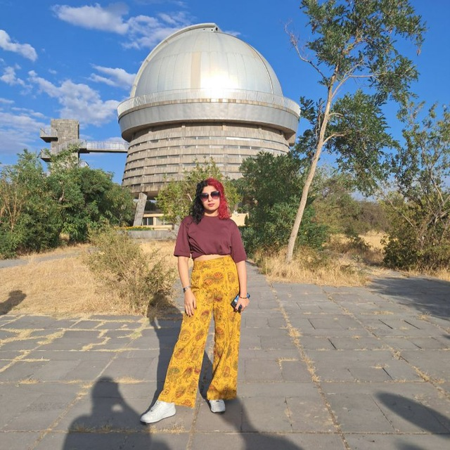
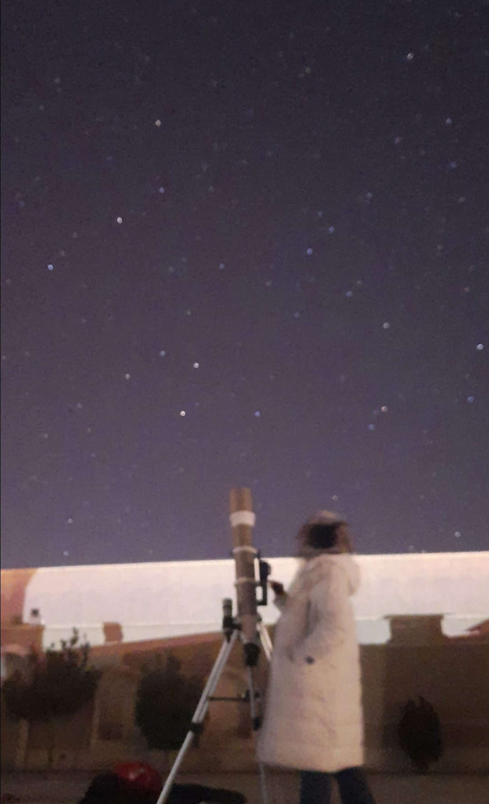

### 🏛️ Professional Observatories

#### **Byurakan Astrophysical Observatory (BAO), Armenia**
* **2.6m Cassegrain Telescope:** Active experience in optical data acquisition for high-energy transient candidates and GRB follow-ups.
* **1m Schmidt Telescope:** Conducted wide-field imaging and survey-based observations.

Operating the 2.6m telescope at Byurakan, Armenia

#### **Iranian National Observatory (INO), Iran**
* **3.4m Optical Telescope:** Familiarity with the operational framework and site testing of the region’s premier flagship telescope.

#### **Mesbah Observatory, Iran**
* **14" Schmidt-Cassegrain (Celestron):** Extensive work in deep-sky imaging, stellar tracking, and CCD photometry.

---

### 🌌 Field & Personal Observations

I believe a true astrophysicist should know the constellations as well as they know their code. I have spent over a decade mastering manual observation.

* **Personal Dobsonian Fleet (8", 10", 12", 14"):** * Expert in manual deep-sky hunting (Messier, NGC, and IC catalogs).
    * Years of experience in telescope collimation, star-hopping, and visual photometry.
* **Solar Astronomy:** Sunspot tracking and white-light solar observation using specialized filtration.

Field observation with my 14" Dobsonian telescope

---

### 🛰️ Space-Based Data Handling
While my feet are on the ground, my research often utilizes space-based "observatories":
* **High-Energy Archives:** Expert in retrieving raw data from **Fermi/LAT** and **Swift (BAT/XRT)**.
* **Spectroscopic Archives:** Analysis of data from the **ESO Archive (FEROS Spectrograph)**.

---

**[🏠 Home](index) | [🔭 Research](research) | [📚 Publications](publications) | [🎨 Hobbies](hobbies) | [🔭 Observational Skills](Observationalskills) | [📄 CV](cv) | [✉️ Contact](contact)**
