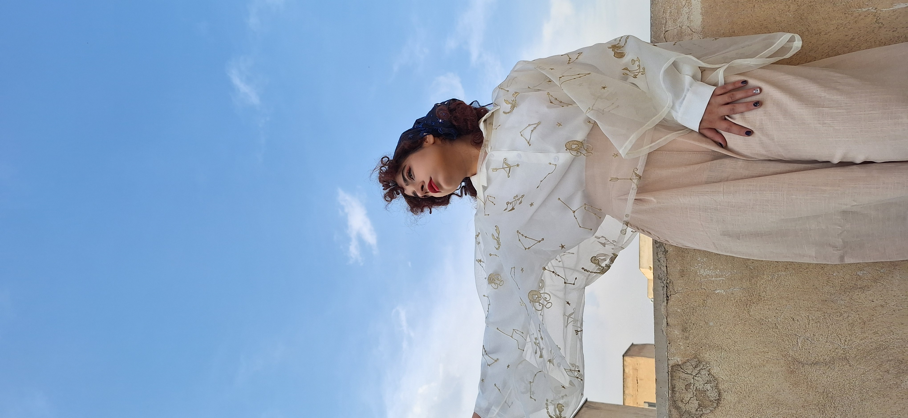

# 🎨 Beyond the Stars

My life is a constant search for harmony—whether it's in the mathematical laws of a galaxy or the precise movements of a dance.

---

### 🩰 Ballet Dancing: The Art of Precision
Ballet is where my discipline meets my creativity. Just like the orbits of planets, ballet requires a perfect balance of strength, grace, and technical accuracy. 
* **Focus:** Classical technique, poise, and rhythmic storytelling.
* **Connection:** I find that the mental focus required for complex astrophysics calculations is very similar to the "flow state" I achieve during a challenging ballet sequence.

---

### 👗 Galactic Fashion & Entrepreneurship
I believe in having "a little bit of galaxy in everything I own." I founded a business selling **handmade galactic clothing and accessories** to share the beauty of the cosmos through wearable art. This venture allowed me to blend my scientific background with my love for design.

<p style="text-align: center; font-style: italic; color: #666;"

---

### 🔭 Astronomy Education & Guiding
For over a decade (2015-2025), I have served as an **amateur astronomer and night sky guide**. 
* **Outreach:** I’ve taught everyone from kindergarten kids to university students. 
* **Goal:** To inspire the next generation of "frontier women" in science, showing them that the sky has no limits.

---

### ⚽ Exploration & Vitality
Living in different cities and countries since I was 18 has made me a global citizen. To keep my energy high and my mind sharp, I enjoy:
* **Soccer:** For teamwork and high-intensity strategy.
* **Traveling:** Visiting observatories and science academies worldwide to experience diverse cultures.

---

**[🏠 Home](index) | [🔭 Research](research) | [📚 Publications](publications) | [🎨 Hobbies](hobbies) | [🔭 Observational Skills](Observationalskills) | [📄 CV](cv) | [✉️ Contact](contact)**
