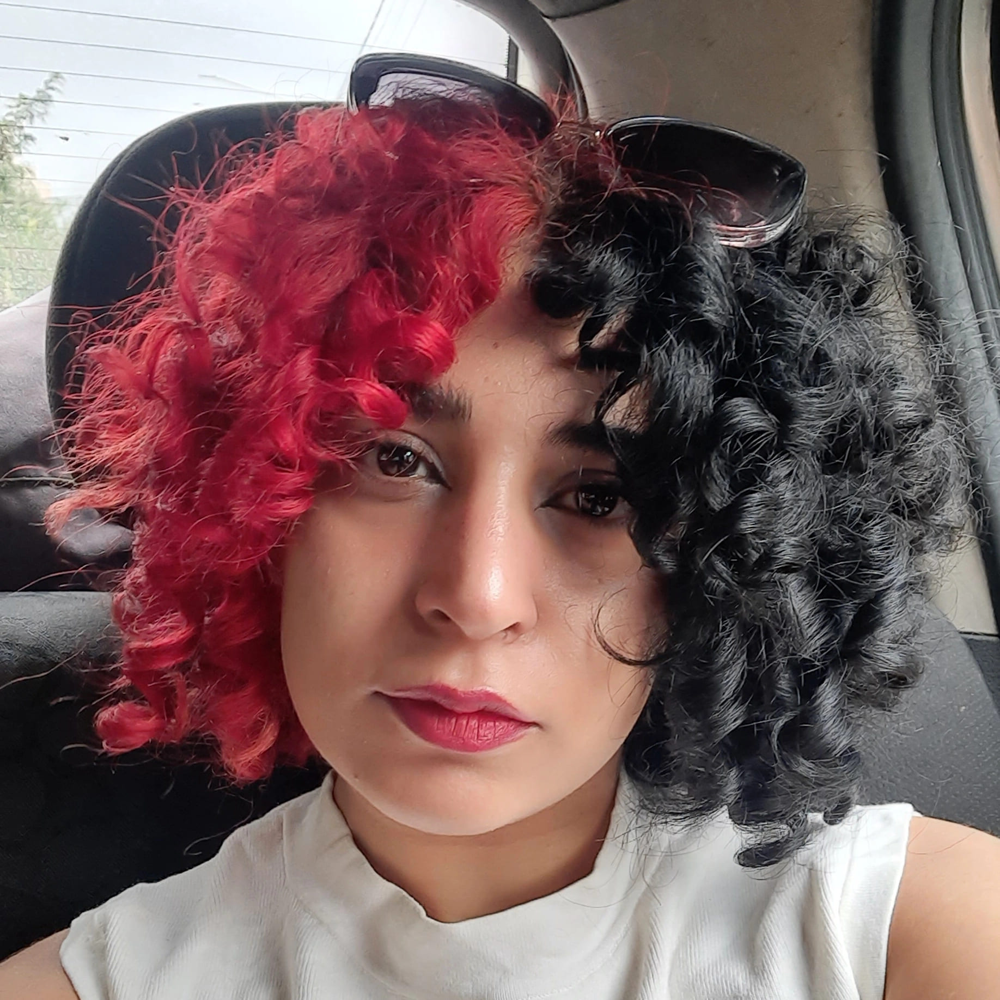
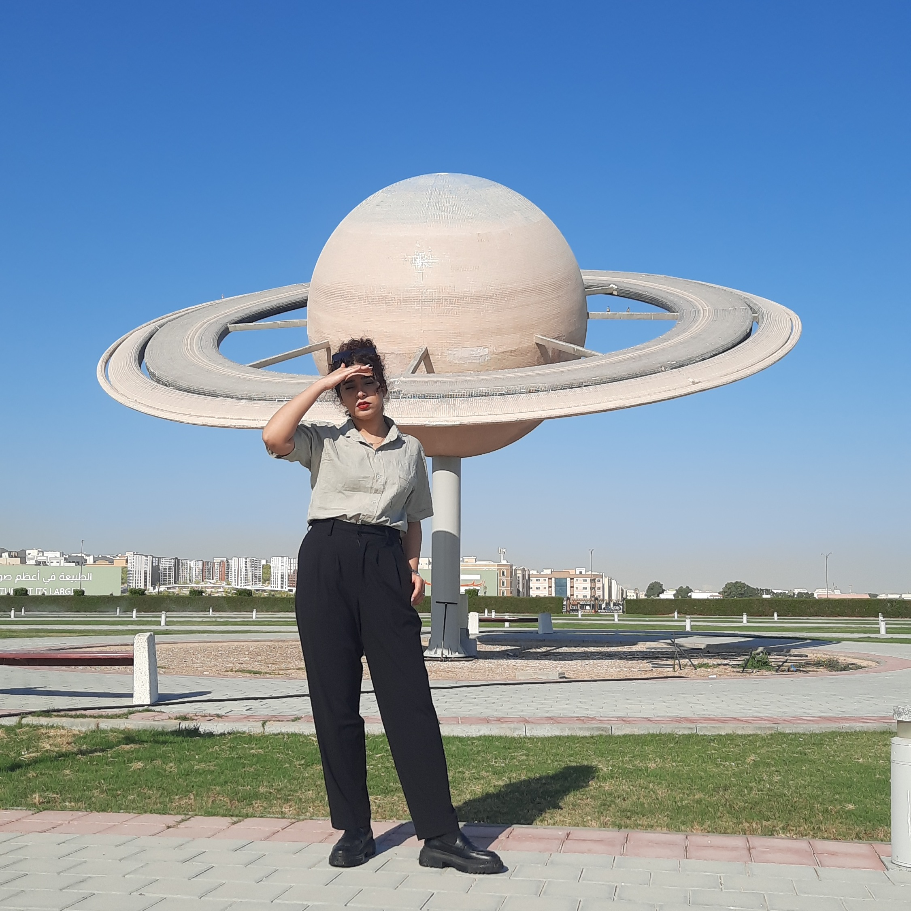

# Shahrzad (Sherry) Sheikhi 👋

### 🌌 Astrophysicist | 💻 Data Scientist | 🚀 Frontier Researcher

I am an astrophysicist and professional data scientist dedicated to decoding the high-energy universe. Currently based in **Yerevan, Armenia**, I work at **CodeCraft Innovations** while continuing research collaborations with **IPM Iran** and **Moscow University**.

My journey is defined by resilience. After successfully defeating a brain tumor during my studies, I committed myself to becoming an idol for girls worldwide to fight for their dreams. My passion for the stars extends to my lifestyle—I even run a business selling handmade galactic clothing and accessories.

---
### 🧭 Navigation
**[🏠 Home](index) | [🔭 Research](research) | [📚 Publications](publications) | [🎨 Hobbies](hobbies) | [🔭Observational skills](Observationalskills) |[📄 CV](cv) | [✉️ Contact](contact)**
